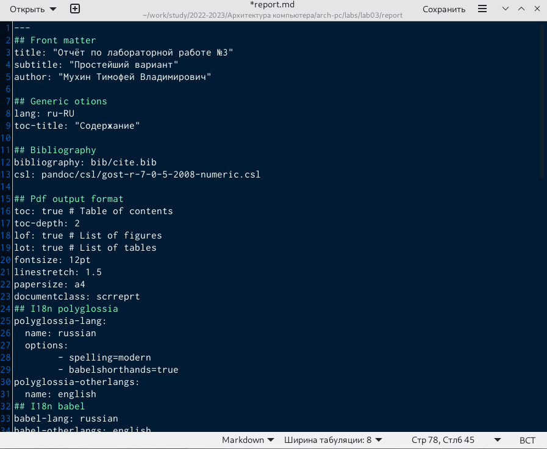

---
## Front matter
title: "Отчет по лабораторной работе №3"
author: "Мухин Тимофей Владимирович"

## Generic otions
lang: ru-RU
toc-title: "Содержание"

## Bibliography
bibliography: bib/cite.bib
csl: pandoc/csl/gost-r-7-0-5-2008-numeric.csl

## Pdf output format
toc: true # Table of contents
toc-depth: 2
fontsize: 12pt
linestretch: 1.5
papersize: a4
documentclass: scrreprt
## I18n polyglossia
polyglossia-lang:
  name: russian
  options:
	- spelling=modern
	- babelshorthands=true
polyglossia-otherlangs:
  name: english
## I18n babel
babel-lang: russian
babel-otherlangs: english
## Fonts
mainfont: PT Serif
romanfont: PT Serif
sansfont: PT Sans
monofont: PT Mono
mainfontoptions: Ligatures=TeX
romanfontoptions: Ligatures=TeX
sansfontoptions: Ligatures=TeX,Scale=MatchLowercase
monofontoptions: Scale=MatchLowercase,Scale=0.9
## Biblatex
biblatex: true
biblio-style: "gost-numeric"
biblatexoptions:
  - parentracker=true
  - backend=biber
  - hyperref=auto
  - language=auto
  - autolang=other*
  - citestyle=gost-numeric
## Pandoc-crossref LaTeX customization
figureTitle: "Рис."
tableTitle: "Таблица"
listingTitle: "Листинг"
lolTitle: "Листинги"
## Misc options
indent: true
header-includes:
  - \usepackage{indentfirst}
  - \usepackage{float} # keep figures where there are in the text
  - \floatplacement{figure}{H} # keep figures where there are in the text
---

# Цель работы

Целью работы является освоение процедуры оформления отчетов с помощью
легковесного языка разметки Markdown.

# Выполнение лабораторной работы

1. Открываем терминал и переходим в каталог курса, сформированный при выполнение лабораторной работы №3. Обновляем локальный репозиторий с помощью команды git pull. 

{ #fig:001 width=70% }

2. Переходим в каталог с шаблоном отчета по лабораторной работе №3. Проводим компиляцию шаблона с использованием Makefile. Для этого используем команду make. 

{ #fig:002 width=70% }

3. Сгенерировались файлы report.pdf и report.docx. Проверяем корректность полученных файлов.

{ #fig:003 width=70% }

4.  Удаляем полученные файлы с использованием Makefile. Для этого вводим
команду make clean. 

{ #fig:004 width=70% }

5. Открываем файл report.md с помощью текстового редактора gedit, заполняем отчёт

{ #fig:005 width=70% }

6. Компилируем отчет с помощью Makefile. Проверяем корректность полученных файлов. 

{ #fig:006 width=70% }

7. Загружаем файлы на GitHub

{ #fig:007 width=70% }

# Выводы

В ходе выполнения лабораторной работы  я освоил процедуры оформления отчетов с помощью
легковесного языка разметки Markdown.

