---
## Front matter
title: "Отчет по лабораторной работе №4"
author: "Мухин Тимофей Владимирович"

## Generic otions
lang: ru-RU
toc-title: "Содержание"

## Bibliography
bibliography: bib/cite.bib
csl: pandoc/csl/gost-r-7-0-5-2008-numeric.csl

## Pdf output format
toc: true # Table of contents
toc-depth: 2
fontsize: 12pt
linestretch: 1.5
papersize: a4
documentclass: scrreprt
## I18n polyglossia
polyglossia-lang:
  name: russian
  options:
	- spelling=modern
	- babelshorthands=true
polyglossia-otherlangs:
  name: english
## I18n babel
babel-lang: russian
babel-otherlangs: english
## Fonts
mainfont: PT Serif
romanfont: PT Serif
sansfont: PT Sans
monofont: PT Mono
mainfontoptions: Ligatures=TeX
romanfontoptions: Ligatures=TeX
sansfontoptions: Ligatures=TeX,Scale=MatchLowercase
monofontoptions: Scale=MatchLowercase,Scale=0.9
## Biblatex
biblatex: true
biblio-style: "gost-numeric"
biblatexoptions:
  - parentracker=true
  - backend=biber
  - hyperref=auto
  - language=auto
  - autolang=other*
  - citestyle=gost-numeric
## Pandoc-crossref LaTeX customization
figureTitle: "Рис."
tableTitle: "Таблица"
listingTitle: "Листинг"
lolTitle: "Листинги"
## Misc options
indent: true
header-includes:
  - \usepackage{indentfirst}
  - \usepackage{float} # keep figures where there are in the text
  - \floatplacement{figure}{H} # keep figures where there are in the text
---

# Цель работы

Целью работы является освоение процедуры компиляции и сборки программ, написанных на ассемблере NASM.

# Выполнение лабораторной работы

1. Создаём каталог для работы с программами на языке ассемблера NASM, переходим в него и создаём текстовый файл с
с названием hello.asm

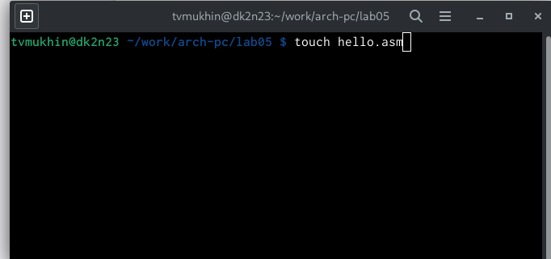{ #fig:001 width=70% }

2. Открываем файл с помощью текстового редактора gedit .

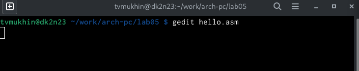{ #fig:002 width=70% }

3. Вводим текст программы Hello World.

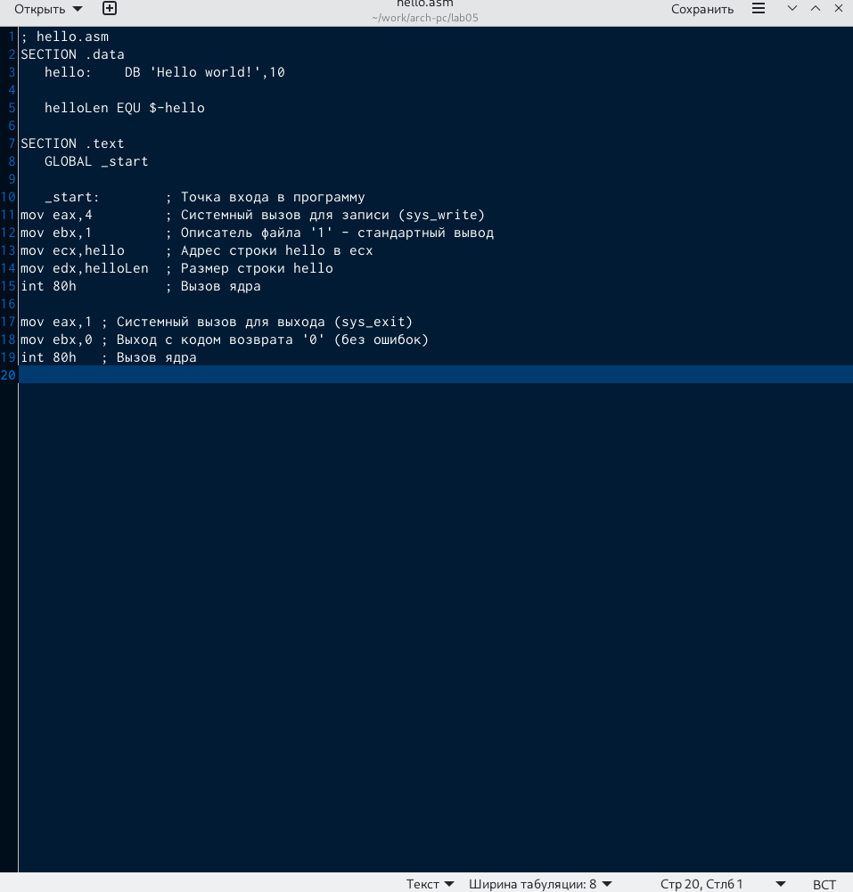{ #fig:003 width=70% }

4.  NASM превращает текст программы в объектный код. Если текст программы набран без ошибок, то транслятор преобразует текст программы из файла hello.asm в объектный код, который запишется в файл
hello.o. Выполняем следующую команду:

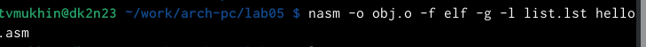{ #fig:004 width=70% }

5. Проверяем, что объектный файл был создан.

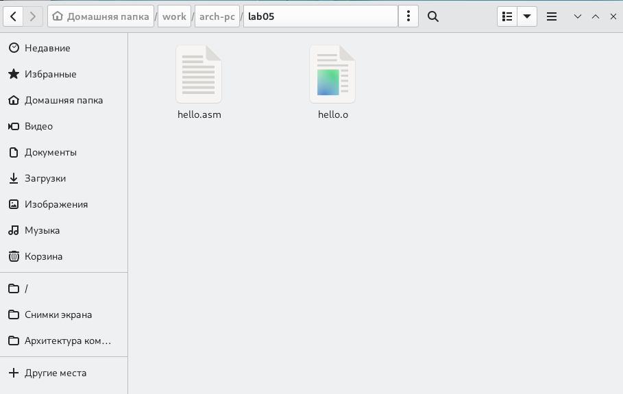{ #fig:005 width=70% }

6. Чтобы получить исполняемую программу,
объектный файл необходимо передать на обработку компоновщику. С помощью команды ls проверяем, что исполняемый файл hello был создан.

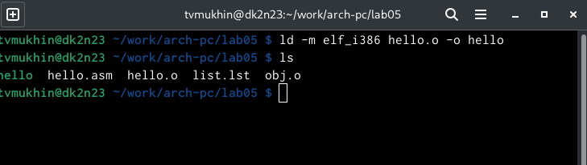{ #fig:006 width=70% }

7.  Запускаем исполняемый файл

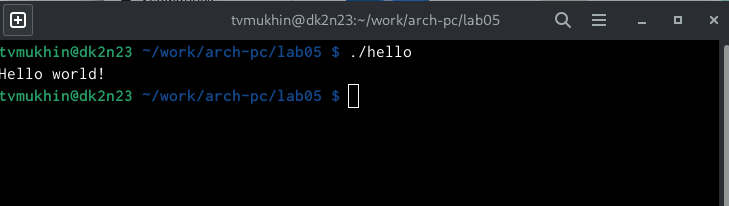{ #fig:007 width=70% }

8. C помощью команды cp создаём копию
файла hello.asm с именем lab5.asm

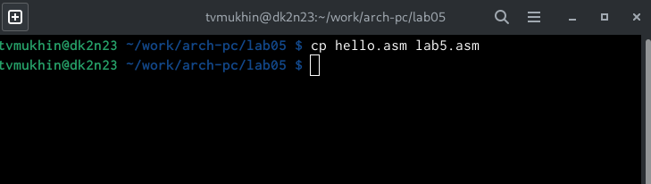{ #fig:008 width=70% }

9. Вносим изменения в текст программы в файле так, чтобы вместо Hello world! на экран выводилась 
строка с фамилией и именем.

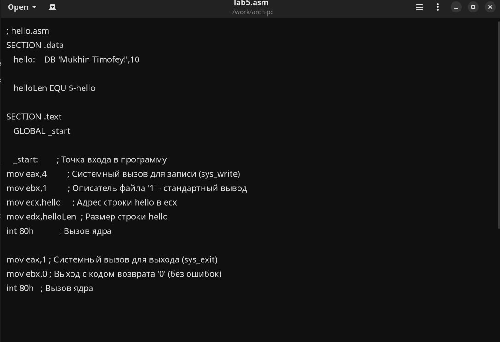{ #fig:009 width=70% }

10. Транслируем полученный текст программы в объектный файл.

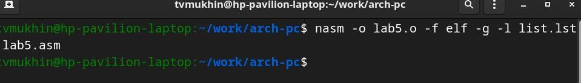{ #fig:010 width=70% }

11.  Выполняем компоновку объектного файла и запускаем получившийся исполняемый файл.

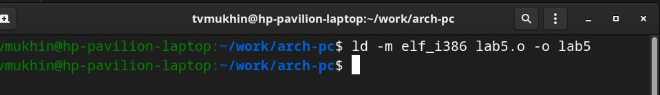{ #fig:011 width=70% }

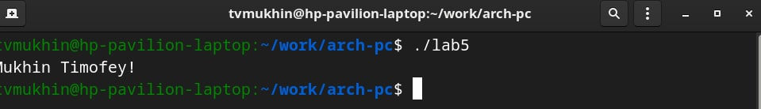{ #fig:011 width=70% }

12. Копируем файлы в локальный репозиторий, загружаем на Github.

# Выводы

В ходе выполнения лабораторной работы я освоил процедуры компиляции и сборки программ, написанных
на ассемблере NASM.
