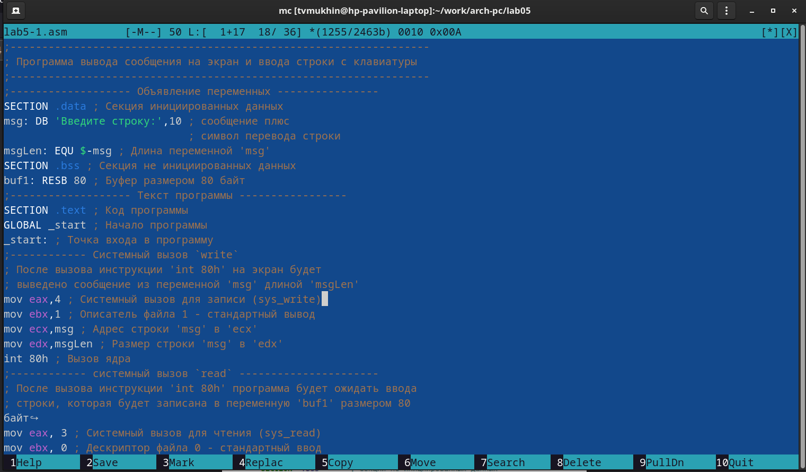
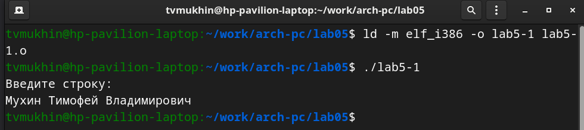
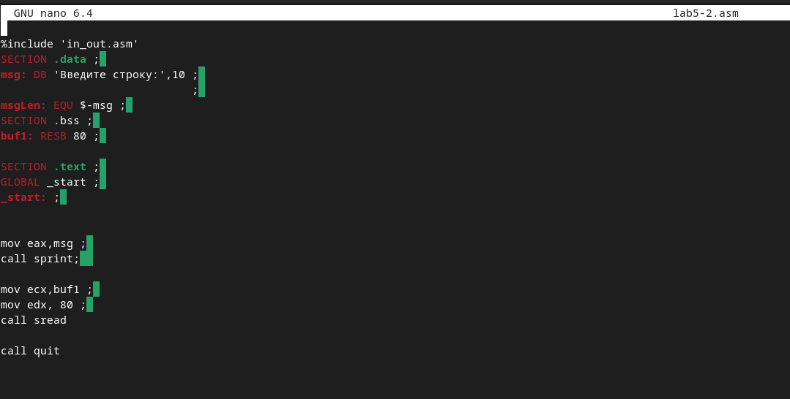

---
## Front matter
title: "Отчет по лабораторной работе №5"
author: "Мухин Тимофей Владимирович"

## Generic otions
lang: ru-RU
toc-title: "Содержание"

## Bibliography
bibliography: bib/cite.bib
csl: pandoc/csl/gost-r-7-0-5-2008-numeric.csl

## Pdf output format
toc: true # Table of contents
toc-depth: 2
fontsize: 12pt
linestretch: 1.5
papersize: a4
documentclass: scrreprt
## I18n polyglossia
polyglossia-lang:
  name: russian
  options:
	- spelling=modern
	- babelshorthands=true
polyglossia-otherlangs:
  name: english
## I18n babel
babel-lang: russian
babel-otherlangs: english
## Fonts
mainfont: PT Serif
romanfont: PT Serif
sansfont: PT Sans
monofont: PT Mono
mainfontoptions: Ligatures=TeX
romanfontoptions: Ligatures=TeX
sansfontoptions: Ligatures=TeX,Scale=MatchLowercase
monofontoptions: Scale=MatchLowercase,Scale=0.9
## Biblatex
biblatex: true
biblio-style: "gost-numeric"
biblatexoptions:
  - parentracker=true
  - backend=biber
  - hyperref=auto
  - language=auto
  - autolang=other*
  - citestyle=gost-numeric
## Pandoc-crossref LaTeX customization
figureTitle: "Рис."
tableTitle: "Таблица"
listingTitle: "Листинг"
lolTitle: "Листинги"
## Misc options
indent: true
header-includes:
  - \usepackage{indentfirst}
  - \usepackage{float} # keep figures where there are in the text
  - \floatplacement{figure}{H} # keep figures where there are in the text
---

# Цель работы

Приобретение практических навыков работы в Midnight Commander. Освоение
инструкций языка ассемблера mov и int.

# Выполнение лабораторной работы

1. Открываем Midnight commander

{ #fig:001 width=70% }

2. Переходим в каталог /work/arch-pc.

{ #fig:002 width=70% }

3. Создаем папку lab05 и переходим в нее.

{ #fig:003 width=70% }

4.  Пользуясь командой touch создаем файл lab5-1.asm, открываем его во встроенном редакторе и вводим текст программы из листинга 6.1, сохраняем изменения

{ #fig:004 width=70% }

5. Используя функциональные клавиши открываем файл для просмотра. .

{ #fig:005 width=70% }

6. Транслируем текст программы lab5-1.asm в объектный файл. Выполяем компоновку объектного файла и запускаем получившийся исполняемый файл.Программа выводит строку 'Введите строку:' и ожидает ввода с
клавиатуры.

{ #fig:006 width=70% }

{ #fig:007 width=70% }

7. Для упрощения написания программ часто встречающиеся одинаковые участки кода можно оформить в виде подпрограмм и сохранить в отдельные файлы, а во всех
нужных местах поставить вызов нужной подпрограммы. 
Скачиваем файл in_out.asm,  копируем его в каталог с файлом lab5-1.asm.
{ #fig:008 width=70% }

{ #fig:009 width=70% }

9. С помощью функциональной клавиши создаем копию файла lab5-1.asm с именем lab5-2.asm

10.  Исправляем текст программы в файле lab5-2.asm с использование подпрограмм из внешнего файла in_out.asm (используем подпрограммы
sprintLF, sread и quit) в соответствии с листингом 6.2)

{ #fig:011 width=70% }

11. Создаём исполняемый файл и проверяем его работу

{ #fig:011 width=70% }

12. Создаём копию файла lab5-1.asm (с названием lab5-11.asm). Вносим изменения в программу (без
использования внешнего файла in_out.asm), так чтобы она работала по
следующему алгоритму:
1) вывести приглашение типа “Введите строку:”
2) ввести строку с клавиатуры
3) вывести введённую строку на экран

{ #fig:011 width=70% }

13.  Получаем исполняемый файл и проверяем его работу. 

{ #fig:011 width=70% }

14. Создаем копию файла lab5-2.asm (с названием lab5-22.asm). Исправляем  текст программы с использование подпрограмм из внешнего файла in_out.asm, так чтобы она работала по следующему алгоритму:
1)вывести приглашение типа “Введите строку:”
2) ввести строку с клавиатуры
3) вывести введённую строку на экран.

{ #fig:011 width=70% }

15. Cоздаем исполняемый файл и проверяем его работу.

{ #fig:011 width=70% }

# Выводы

В ходе выполнения лабораторной работы я приобрел практические навыки работы в Midnight Commander, изучил инструкции языка ассемблера mov и int.
