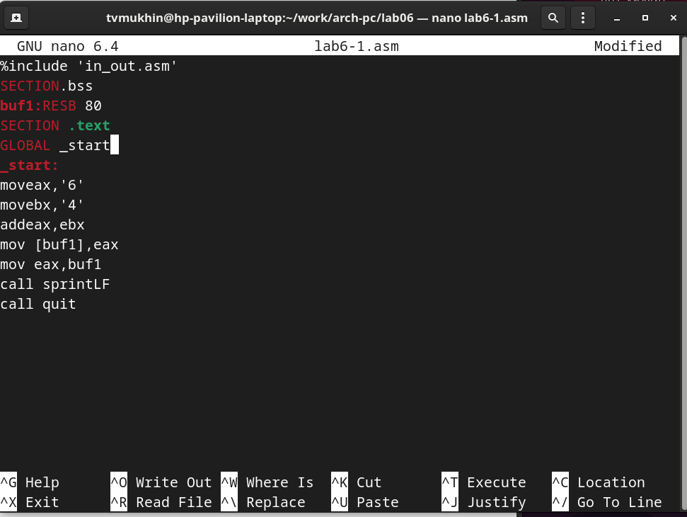

---
## Front matter
title: "Отчет по лабораторной работе №6"
author: "Мухин Тимофей Владимирович"

## Generic otions
lang: ru-RU
toc-title: "Содержание"

## Bibliography
bibliography: bib/cite.bib
csl: pandoc/csl/gost-r-7-0-5-2008-numeric.csl

## Pdf output format
toc: true # Table of contents
toc-depth: 2
fontsize: 12pt
linestretch: 1.5
papersize: a4
documentclass: scrreprt
## I18n polyglossia
polyglossia-lang:
  name: russian
  options:
	- spelling=modern
	- babelshorthands=true
polyglossia-otherlangs:
  name: english
## I18n babel
babel-lang: russian
babel-otherlangs: english
## Fonts
mainfont: PT Serif
romanfont: PT Serif
sansfont: PT Sans
monofont: PT Mono
mainfontoptions: Ligatures=TeX
romanfontoptions: Ligatures=TeX
sansfontoptions: Ligatures=TeX,Scale=MatchLowercase
monofontoptions: Scale=MatchLowercase,Scale=0.9
## Biblatex
biblatex: true
biblio-style: "gost-numeric"
biblatexoptions:
  - parentracker=true
  - backend=biber
  - hyperref=auto
  - language=auto
  - autolang=other*
  - citestyle=gost-numeric
## Pandoc-crossref LaTeX customization
figureTitle: "Рис."
tableTitle: "Таблица"
listingTitle: "Листинг"
lolTitle: "Листинги"
## Misc options
indent: true
header-includes:
  - \usepackage{indentfirst}
  - \usepackage{float} # keep figures where there are in the text
  - \floatplacement{figure}{H} # keep figures where there are in the text
---

# Цель работы

Освоение арифметических инструкций языка ассемблера NASM.

# Выполнение лабораторной работы

1. Создаем каталог для програм лабораторной работы №6

{ #fig:001 width=70% }

2. Переходим в каталог и создаем файл lab6-1.asm

{ #fig:002 width=70% }

3. Программа вывода значения регистра eax. Вводим текст программы из листинга 7.1. 

{ #fig:003 width=70% }

4.  Создаем исполняемый файл и запускаем его. В данном случае при выводе значения регистра eax мы ожидаем увидеть
число 10. Однако результатом будет символ j. Это происходит потому, что код
символа 6 равен 00110110 в двоичном представлении (или 54 в десятичном
представлении), а код символа 4 – 00110100 (52). Команда add eax,ebx запишет
в регистр eax сумму кодов – 01101010 (106), что в свою очередь является кодом
символа j.

{ #fig:004 width=70% }

{ #fig:005 width=70% }

5. Изменим текст программы и вместо символов, запишем в регистры числа.

{ #fig:006 width=70% }

6. Создаем исполняемый файл и запускаем его

{ #fig:008 width=70% }

7. Для работы с числами в файле in_out.asm реализова-
ны подпрограммы для преобразования ASCII символов в числа и обратно.
Преобразуем текст программы из Листинга 7.1 с использованием этих
функций. Создаем файл lab6-2.asm.

{ #fig:008 width=70% }

8. В результате работы программы мы получим число 106. В данном случае, как
и в первом, команда add складывает коды символов ‘6’ и ‘4’ (54+52=106). Однако,
в отличии от программы из листинга 7.1, функция iprintLF позволяет вывести
число, а не символ, кодом которого является это число.

{ #fig:011 width=70% }

9. Создаём исполняемый файл и проверяем его работу

{ #fig:011 width=70% }

10. Аналогично предыдущему примеру изменим символы на числа. Проверяем работу программы.

{ #fig:011 width=70% }

11.  В качестве примера выполнения арифметических операций в NASM приведем программу вычисления арифметического выражения. Создаем файл lab6-3.asm 

{ #fig:011 width=70% }

12. Создаем исполняемый файл и запускаем его.

{ #fig:011 width=70% }

13. Программа вычисления вычисления варианта задания по
номеру студенческого билета. Программа работает по следующему алгоритму: 1)вывести запрос на введение № студенческого билета.
 2)вычислить номер варианта по формуле  3) вывести на экран номер варианта.

{ #fig:011 width=70% }

14. Создаем исполняемый файл и проверяем правильность работы программы

{ #fig:011 width=70% }

# Выводы

В ходе выполнения лабораторной работы я освоил арифметические инструкций языка ассемблера NASM.
